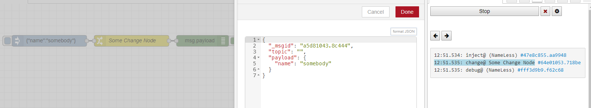
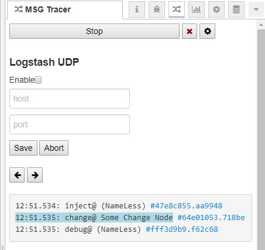
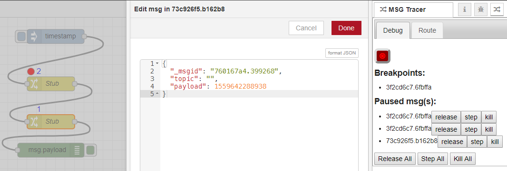

# _msg-tracer_ module for node-red

This node-red module adds 2 new features to Node-RED
## **`msg` tracing**
* Shows a list of nodes where the `msg` object passed through
* Clicking the node name presents the `msg` object that node received.
* Clicking the node ID on the list entry locates the node.
* You can re-trace the steps of the msg object by clicking the Left/Right arrows (or setup shortcuts in Node-RED keyboard) 

##### View steps and `msg` contents:

##### Can be configured to log each step & msg contents to logstash via UDP.

## **Debugging & Breakpoints**

    
##### Adding a breakpoint
1. Select the node(s) you would like to toggle a breakpoint for.
1. Click the red toggle breakpoint button (or keyboard shortcut) 
    You should see a red circle above the node, indicating a breakpoint is on it. 
    a new entry in the **breakpoints** list will be added, clicking it will reveal the relevant node.
1. Once a msg arrives at a node marked with a breakpoint, the msg will halt, and a number indicator will appear above the node, showing how many msg(s) await. 
   
#### Handling paused msg(s)
Once a msg is paused, you have multiple choices for handling it.

##### Release `msg`
Releases the msg to continue passing through nodes until the end (or the next breakpoint if there is one in it's path).

##### Step `msg`
The msg will continue one step and will halt on the next node(s).
    
##### Kill `msg`
Destroys the msg, denying it from reaching any other nodes. 
    
##### Edit `msg`
Clicking on any paused msg (node ID) will focus on the receiving node, and popup an editor where you can modify the `msg` object before deciding what to do with it.

Additionally, you will find "All" buttons for each of the above choices to handle all paused msg(s) with a single click (you can also set keyboard shortcuts for these buttons).

